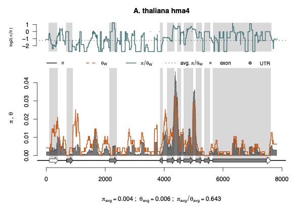

# gSoup 

## gSoup: An R package to perform various genetic analyses

Piyal Karunarathne

I wrote this package to assemble all essential bioinformatic tools in
one place because I was tired of having to switch between different
platforms to perform basic (and advance) population genetics and
molecular evolution analyses. Whatever I find useful I will add to the
package; hence it’s a SOUP. If you have any tools, analyses, plottings,
or anyother tool you like to use in R, let me know. I will add it. Let’s
make this an ALL-IN-ONE package.

Here is a plot I created with the package.

***A tutorial of functions in the package will be up soon***

## Installation

-   NOT AVAILABLE ON CRAN YET

-   You can install the development version of gSoup from
    [GitHub](https://github.com/) with:

<!-- -->

        if (!requireNamespace("devtools", quietly = TRUE)) 
            install.packages("devtools") 
        devtools::install_github("piyalkarum/gSoup", build_vignettes = FALSE)
